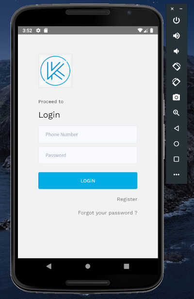
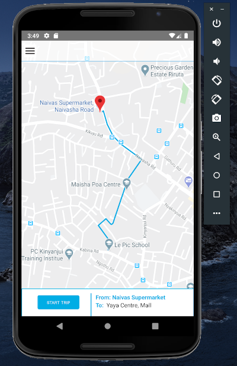
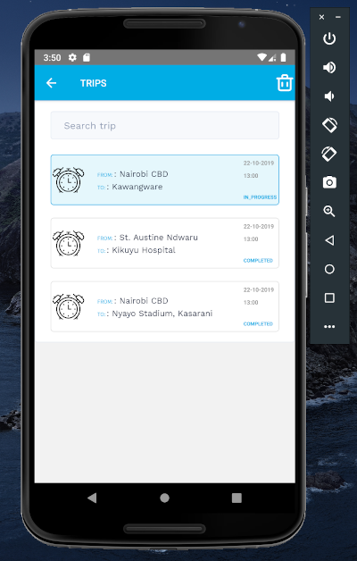
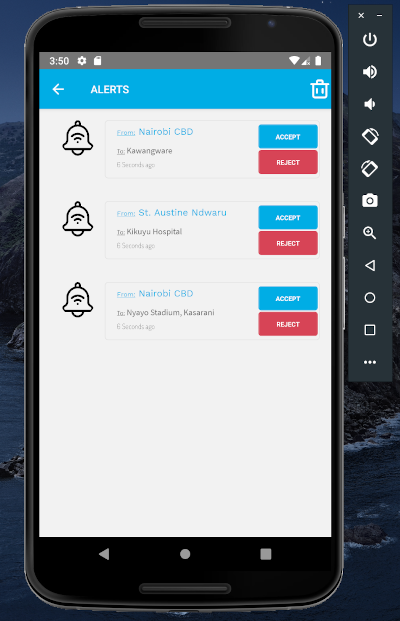
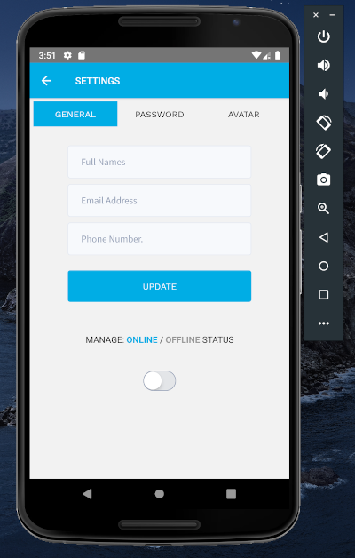

#### Drivers app - Kwik

| Tools | Frameworks | Code Formatting | Code Style Guide |
| --- | --- | --- | --- |
| TypScript | React Native | Prettier | Airbnb |
| JavaScript |  |  | |
| Google Map | | | |
| Redux |  | | |

Running the project locally
- Clone the project.
- CD to the root directory via terminal and run `npm i`
- Make sure you have android emulator running.
- Make sure you have SDK path set on your environment.
- Run `react-native-start` on a terminal to start the app.
- Run `react-native run-android` on another terminal to install and view the app on the emulator.

 
Screenshots:
 

|  |  |
| --- | --- |
 |  |
 |  |
 | |

